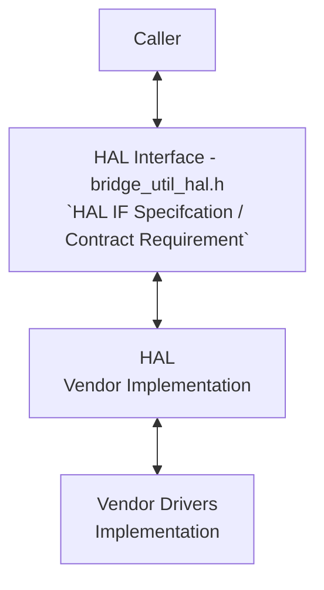
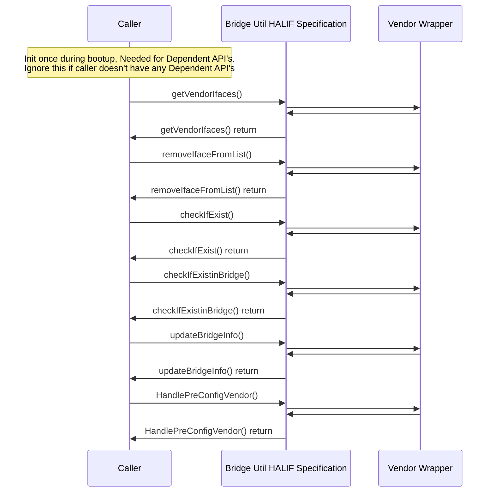

# Bridge Util HAL Documentation

## Acronyms

- `HAL` \- Hardware Abstraction Layer
- `RDK-B` \- Reference Design Kit for Broadband Devices
- `OEM` \- Original Equipment Manufacture

## Description

The diagram below describes a high-level software architecture of the Bridge Util HAL module stack.

Bridge Util HAL is an abstraction layer to interact with vendor software to control settings such as modes, connection enable/disable, QoS configuration, IPv4 config, etc.

## Component Runtime Execution Requirements

### Initialization and Startup

The below-mentioned APIs initialize the Bridge util HAL layers/code. The Bridge util client module should call the mentioned APIs initially during bootup/initialization and when creating/updating/deleting bridge.

1. `HandlePreConfigVendor()`
2. `HandlePostConfigVendor()`

Third-party vendors must implement appropriate handling to ensure operational requirements are met, this interface should block until hardware readiness.

## Threading Model

The interface is not required to be thread-safe.

Any module that is invoking the MTA HAL API should ensure calls are made in a thread-safe manner.

Vendors can create internal threads/events for operational needs, but must ensure synchronization before closure cleanup.

## Process Model

API's are expected to be called from multiple process.

## Memory Model

### Caller Responsibilities

Ownership of Memory: Callers must assume full responsibility for managing any memory explicitly given to the module functions to populate. This includes proper allocation and de-allocation to prevent memory leaks.

### Module Responsibilities

Internal Memory Handling: Modules must independently allocate and de-allocate memory for their internal operations, ensuring efficient resource management.

Mandatory Cleanup: Modules are required to release all internally allocated memory upon closure to prevent resource leaks.

TODO: State a footprint requirement. Example: This should not exceed XXXX KB.

## Power Management Requirements

The HAL is not involved in any of the power management operation.

## Asynchronous Notification Model

There are no asynchronous notifications.

## Blocking calls

The API's are expected to work synchronously and should complete within a time period commensurate with the complexity of the operation and in accordance with any relevant specification.

Any calls that can fail due to the lack of a response should have a timeout period in accordance with any API documentation.

TODO: As we state that they should complete within a time period, we need to state what that time target is, and pull it from the spec if required. Define the timeout requirement.

TODO: Error return codes will be extended in the future to give more detail.

## Internal Error Handling

All the Bridge Util HAL API's should return error synchronously as a return argument. HAL is responsible to handle system errors(e.g. out of memory) internally.

## Persistence Model

There is no requirement for HAL to persist any setting information.

## Nonfunctional requirements

Following non functional requirement should be supported by the component.

## Logging and debugging requirements

The Bridge util HAL component must record all errors and critical informative messages. This can be achieved by using either the printf or the syslog method. These tools are useful in identifying, and debugging the issues and understanding the functional flow of the system.

It is recommended that each HAL component follows the same logging process. If logging is required, vendors should log in to the `bridgeUtils.log` file, which can be found in the `/var/tmp/` or `/rdklogs/logs/` directories.  

Logging should be defined with log levels as per Linux standard logging. The logging levels specified by the Linux standard logging, in descending order of severity, are FATAL, ERROR, WARNING, NOTICE, INFO, DEBUG, TRACE.

## Memory and performance requirements

The component should not contributing more to memory and CPU utilization while performing normal operations and Commensurate with the operation required.

## Quality Control

Bridge util HAL implementation should pass checks using any third-party tools like `Coverity`, `Black Duck`, `Valgrind` etc. without any issues to ensure quality.

There should not be any memory leaks/corruption introduced by HAL and underneath 3rd party software implementation.

## Licensing

Bridge Util HAL implementation is expected to released under the Apache License 2.0.

## Build Requirements

The source code should be able to be built under Linux Yocto environment and should be delivered as a shared library named as `libhalbridge_utils.so`

## Variability Management

Changes to the interface will be controlled by versioning, vendors will be expected to implement to a fixed version of the interface, and based on SLA agreements move to later versions as demand requires.

Each API interface will be versioned using [Semantic Versioning 2.0.0](https://semver.org/), the vendor code will comply with a specific version of the interface.

## WAN or Product Customization

None

## Interface API Documentation

All HAL function prototypes and datatype definitions are available in `bridge_util_hal.h` file.
     1. Components/Process must include bridge_util_hal.h to make use of Bridge Util HAL capabilities.
     2. Components/Process should add linker dependency for `libbridge_utils.so`.

## Theory of operation and key concepts

Covered as per "Description" sections in the API documentation.

## Sequence Diagram

